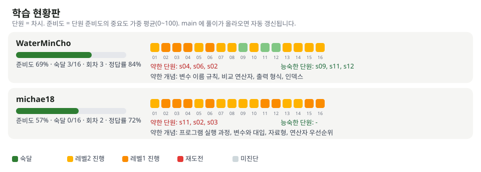

# 학습 현황판

| 이름 | 준비도 | 숙달 | 진행 중 레벨 | 약한 단원 | 능숙한 단원 | 약한 개념 | 회차 | 마지막 풀이 |
|---|---|---|---|---|---|---|---|---|
| WaterMinCho | ▓▓▓▓▓▓▓░░░ 70% | 0/16 | L1 4 · L2 12 | s02, s03, s04 | - | 변수 이름 규칙, 비교 연산자, 출력 형식, 인덱스 | 2 | 2026-10-08 16:25 |

단원 번호 = 차시. 기준: 마지막 풀이 2026-10-08 16:25. main 에 풀이가 올라올 때마다 Actions 가 갱신합니다.
