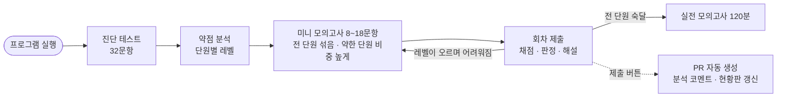

# ROKEY 파이썬 스터디

ROKEY 11기 **파이썬 교과목 평가(10/16)** 를 스터디원 모두가 잘 보기 위한 학습 프로그램입니다.
실행하면 창이 열리고, 그 안에서 문제 받기 → 풀기 → 채점 → 해설 → 제출까지 끝납니다.
한 명 한 명의 결과에 맞춰 다음 문제를 골라 주며, 매 회차가 전 단원을 섞은 **미니 모의고사**입니다.


## 학습 현황판


사람별 준비도·숙달 단원·약한 단원·약한 개념. 제출한 풀이가 main 에 합쳐질 때마다 자동 갱신됩니다. [표로 보기](https://github.com/WaterMinCho/rokey-python-study/blob/dashboard/DASHBOARD.md)

## 평가 조건 요약

| 항목 | 내용 |
|---|---|
| 일시 | 10/16(금) 14:30 ~ 16:30, 프로그래머스 |
| 범위 | 강의 자료 + 주간 요약본 |
| 유형 | 빈칸 채우기, 반환값 문제, 출력 문제, 객관식 |
| 채점 | **부분 점수 없음**, 요구한 형식과 정확히 일치해야 정답 |
| 금지 | IDE·VSCode·파이썬 레퍼런스·메모·검색 (실행하기 버튼만 가능) |

그래서 화면도 시험처럼 만들었습니다. 왼쪽에 문제, 오른쪽에 답안, 아래에 실행·제출이 있고 자동완성과 문법 강조는 없습니다.

## 처음 한 번

준비물은 **파이썬 3.10~3.14**(64비트)와 **git** 입니다. `python --version` 으로 확인하세요.

1. 스터디장이 보낸 저장소 초대를 수락합니다(GitHub 알림 또는 메일).
2. 저장소를 내 컴퓨터로 가져옵니다.

   ```bash
   git clone https://github.com/WaterMinCho/rokey-python-study.git
   ```

3. 프로그램을 실행합니다. 폴더 안의 **`start.bat`**(Windows) 또는 **`start.command`**(macOS)를 더블클릭하거나, 터미널에서 실행합니다.

   ```bash
   cd rokey-python-study
   python study.py
   ```

   `python` 명령이 없으면 `python3` 로 실행하세요.

4. 처음 실행하면 화면에 필요한 PyQt6 를 설치할지 묻습니다(수업 때 이미 설치했다면 묻지 않습니다). `y` 를 누르면 내려받기 약 85MB, 설치 후 약 250MB 가 `~/.rokey-study/venv` 에 설치됩니다. 시스템 파이썬과 이 폴더는 건드리지 않으며, 지우려면 그 폴더만 삭제하면 됩니다.
5. 창이 열리면 깃허브 ID 를 입력합니다. 바로 **진단 테스트**(32문항, 약 30분)가 준비됩니다.

> 파이썬을 새로 설치한다면 **3.14** 를 고르세요([내려받기](https://www.python.org/downloads/latest/python3.14/)). 10/9 에 나오는 3.15 는 PyQt6 가 아직 지원하지 않습니다.

## 매일 하는 일

프로그램을 켜고 **지금 할 일** 버튼을 누르면 됩니다. 켤 때마다 새 문제를 자동으로 받아 옵니다.


1. **풀기** — 문항을 골라 답을 적습니다. 답은 자동으로 저장되므로 창은 언제 닫아도 됩니다.
   - 객관식은 번호 버튼, 출력 예측·단답은 따옴표 없이 화면에 나올 그대로 적습니다.
   - 코드 문항의 **코드 실행**은 문제에 보이는 예시만 돌려 보는 기능입니다(시험의 '실행하기'). 몇 번을 눌러도 기록되지 않습니다.
2. **회차 제출** — 채점은 이때 한 번 합니다. 안 푼 문항은 시험처럼 오답으로 처리됩니다.
3. **결과와 해설** — 점수, 단원별 판정(진급·유지·재도전), 문항별 정답과 해설을 봅니다. 틀린 문항은 '다시 풀기'로 고쳐 볼 수 있지만, 숙달 판정에는 첫 제출만 반영됩니다.
4. **제출(PR 올리기)** — 버튼 하나로 내 풀이가 GitHub 에 올라가고 PR 이 만들어집니다. 잠시 뒤 PR 에 분석 코멘트가 달립니다.


글자 크기는 Ctrl(맥은 Cmd) 과 `+`, `-`, `0` 으로 조절합니다.

### 한눈에 보기



### 맞춤 학습이 돌아가는 방식

- **단원** = 차시(1~16), **레벨** = 1 기본 · 2 응용 · 3 심화. 진단 테스트로 단원마다 출발 레벨을 정합니다(2문항 모두 맞히면 레벨2부터).
- 매 회차는 **전 단원을 섞은 미니 모의고사**입니다. 약한 단원일수록 자주 나오고, 숙달한 단원도 복습으로 가끔 나옵니다. 코드 문제가 약 40%, 나머지는 퀴즈입니다.
- 문항 수(8~18개)는 그 사람의 필요로 정합니다. 보강할 단원이 많으면 길고(단원당 1.5~2.5문항), 숙달 단원이 많으면 짧게 복습만 합니다. 직전 회차 득점률이 절반 아래면 짧게 끊어 자주 피드백하고, 90% 이상이면 조금 더 냅니다.
- 각 단원의 문항은 그 단원의 현재 레벨에서 나오므로, 레벨이 오를수록 회차 전체가 어려워집니다.
- 한 레벨에서 최근 2문항을 모두 맞히거나 4문항 중 3개 이상 맞히면 **다음 레벨로 진급**, 정답률이 절반 아래면 **같은 레벨을 다른 문항으로 재도전**합니다.
- 레벨2까지 통과하면 그 단원은 **숙달**. 숙달 단원이 절반을 넘으면 복습도 심화(레벨3) 문항으로 바뀝니다. 모든 단원이 숙달되면 실전 모의고사 `m1`(120분, 100점)을 권합니다.
- 틀린 문항은 2회차 뒤 다시 나오고(오답 재출제), 오래 안 본 숙달 단원은 다시 나오며(간격 반복), 상속·GUI·예외 처리·정규표현식 단원은 더 자주 나옵니다(중요도 1.5). 자세한 숫자는 [docs/CRITERIA.md](docs/CRITERIA.md).
- **시험 준비도**(0~100)는 단원 준비도의 중요도 가중 평균입니다. 홈 화면과 현황판에 표시됩니다.

## 제출과 피드백

**제출(PR 올리기)** 버튼이 하는 일은 git 으로 하면 브랜치 만들기 → 커밋 → 푸시 → PR 만들기입니다. 프로그램이 대신 합니다.

- 내 풀이 폴더(`submissions/<내 ID>/`)만 `study/<내 ID>` 브랜치로 올라갑니다. 다른 파일은 올라가지 않습니다.
- 올라가면 저장소가 PR 을 자동으로 만들고, 단원별 상태와 약한 개념을 분석한 코멘트를 답니다.
- 스터디 시간에 서로의 PR 을 보며 약한 단원을 설명해 주고, **Squash and merge** 로 합칩니다. 합쳐지면 현황판이 갱신됩니다.
- 더 풀고 다시 누르면 열려 있는 PR 에 이어서 올라갑니다.

**첫 제출 때는 GitHub 로그인이 한 번 필요합니다.** Windows 는 브라우저 로그인 창이 뜹니다. macOS 는 [docs/GIT_GUIDE.md](docs/GIT_GUIDE.md)의 '첫 로그인'을 따라 한 번 설정하세요. PR 에서 서로 피드백하는 방법도 그 문서에 그림으로 정리해 두었습니다.

## 채점 규칙

| 유형 | 답하는 방법 | 채점 |
|---|---|---|
| 객관식 | 번호 버튼 (복수 정답 문항은 여러 개) | 정답과 정확히 일치 |
| 출력 예측 | 출력될 내용을 그대로 | 글자 단위로 일치 |
| 단답 | 한 줄 | 정확히 일치(대소문자 구분) |
| 빈칸 채우기 | 코드의 `____` 자리만 | 빈칸 외 수정 금지 + 테스트 전부 통과 |
| 반환값 | `solution` 함수 완성 | 반환값과 **자료형**까지 일치 (3 ≠ 3.0) |
| 출력 | 프로그램 작성 | 출력이 글자 단위로 일치 |

- 테스트를 **전부** 통과해야 점수를 받습니다(부분 점수 없음). 출력 비교에서 무시하는 것은 줄 끝 공백과 맨 끝 빈 줄뿐입니다.
- `input("안내 문구")` 의 안내 문구는 채점 출력에 포함되지 않습니다. 한 문제의 실행 제한은 5초입니다.
- 해설은 회차를 제출한 뒤에 열립니다.

## 문제 은행

| 세트 | 내용 |
|---|---|
| `s01` ~ `s16` | 1~16차시 (파이썬 소개 → 프로그래밍 기초 → 조건문 → 리스트·딕셔너리 → 반복문 → 함수 1·2 → 자료구조와 알고리즘 → 클래스 1·2 → GUI → 파일 처리 → 예외·문자열·람다·map → 정규표현식 → 고급 함수 → 알고리즘 1) |
| `m1` | 모의고사 1회 — 120분, 100점 |
| `c1` · `c2` | 코딩테스트 연습 Lv.1 · Lv.2 (선택) |
| `s00` | 도구 사용법 연습 |

차시별로 통째로 풀지는 않습니다(회차마다 섞여서 나옵니다). 대신 각 차시 폴더의 `README.md` 는 그 차시 개념 정리와 시험에서 헷갈리기 쉬운 포인트라 복습용으로 좋습니다.
새 차시가 진행되면 세트가 추가되고, 다음 회차부터 자동으로 섞여 나옵니다.
강의 자료(PDF)는 저작물이라 저장소에 넣지 않았습니다.

## 스터디 시간 진행 예 (16:40~)

| 시간 | 내용 |
|---|---|
| 16:40 ~ 17:25 | 프로그램을 켜고 각자 이번 회차 풀기 |
| 17:25 ~ 17:40 | 회차 제출, 결과와 해설 확인, 틀린 문항 다시 풀기 |
| 17:40 ~ 18:00 | 제출(PR 올리기), 서로의 PR 을 보며 약한 단원 설명하기 |

## 터미널로 쓰기 (선택)

화면 없이도 쓸 수 있습니다. 답은 `submissions/<내 ID>/<회차>/` 의 `quiz.py` 와 `.py` 파일에 직접 적습니다.

| 명령 | 하는 일 |
|---|---|
| `python study.py go` | 다음 할 일 이어 가기 (진단 → 풀기 → 채점 → 다음 회차) |
| `python study.py me` | 내 단원별 숙달도·약한 개념 |
| `python study.py explain s03_Q4` | 해설·정답 보기 |
| `python study.py grade r02` | 지난 회차 다시 채점 |
| `python study.py start m1` | 실전 모의고사 (120분 타이머), 채점은 `grade m1` |
| `python study.py analyze` | 전원 학습 분석 (스터디장용) |

## 저장소 구조

```
start.bat / start.command  더블클릭 실행
study.py                 실행기와 터미널 명령, 문제 은행 로딩·채점기
bootstrap.py             화면 실행 준비(PyQt6 확인·설치)
gui/                     화면 (PyQt6)
session.py               화면과 터미널이 함께 쓰는 서비스 계층
adaptive.py              맞춤 학습 엔진 (단원별 숙달도, 회차 구성, 준비도)
gitflow.py               문제 받기·제출
mdlite.py                문제 본문(마크다운) 표시용 변환기
problems/<세트>/         문제 은행
submissions/<내 ID>/     내 회차·풀이·profile.json
docs/                    GIT_GUIDE(제출·피드백), CRITERIA(평가 기준), AUTHORING(출제 규격)
tools/, tests/           출제자·CI 용 도구와 테스트
```

정답·해설은 `problems/<세트>/sealed.json` 에 묶여 있습니다. 실수로 스포일러를 보지 않게 가려 둔 것이고 암호화는 아닙니다.

## 불편하거나 이상하면 이슈로

저장소 **Issues → New issue** 에서 양식을 골라 적어 주세요. 프로그램이 오류 창을 띄우면 '오류 내용 복사'로 붙여 넣고, 문제가 이상할 때는 문항 ID(예: `s03_Q4`)를 적습니다.

## 스터디장용

- 스터디원 초대: 저장소 **Settings → Collaborators**
- 전원 학습 분석: `python study.py analyze` (main 에 풀이가 합쳐질 때마다 현황판에도 반영됩니다)
- 문항이 모자라면 Actions 가 **"출제 요청" 이슈**를 자동으로 만들거나 갱신합니다. 그 표대로 문제를 추가하면 다음 실행부터 회차에 포함됩니다.
- 문제 추가·수정: [docs/AUTHORING.md](docs/AUTHORING.md). 커밋 전 `python tools/verify_bank.py`, `python tools/seal.py check`.
- **문제·도구를 고칠 때는 별도 브랜치에서** 작업하세요. `main` 이나 `study/<ID>` 브랜치에서 풀이 폴더 밖의 파일을 고친 채 프로그램을 켜면, 문제 받기가 그 수정을 `.git/study-backup/` 에 복사하고 되돌립니다.
- main 은 PR 로만 바뀝니다(관리자는 직접 push 가능). 머지 방식은 Squash 만 켜 두었고, 머지되면 브랜치가 자동으로 지워집니다.

## 라이선스

- 프로그램 코드(`study.py`, `adaptive.py`, `session.py`, `gitflow.py`, `bootstrap.py`, `mdlite.py`, `gui/`, `tools/`, `tests/`)는 [GPL-3.0](LICENSE)입니다. 화면에 쓰는 PyQt6 가 GPL-3.0 이라 같은 조건을 따릅니다.
- `problems/` 의 문제·해설·개념 정리는 이 스터디의 학습 자료이며 GPL 적용 대상이 아닙니다. 다른 곳에 옮겨 쓰려면 스터디장에게 문의해 주세요.
