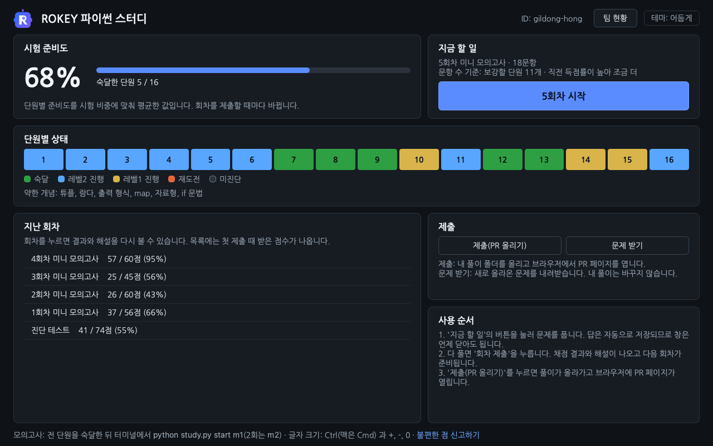
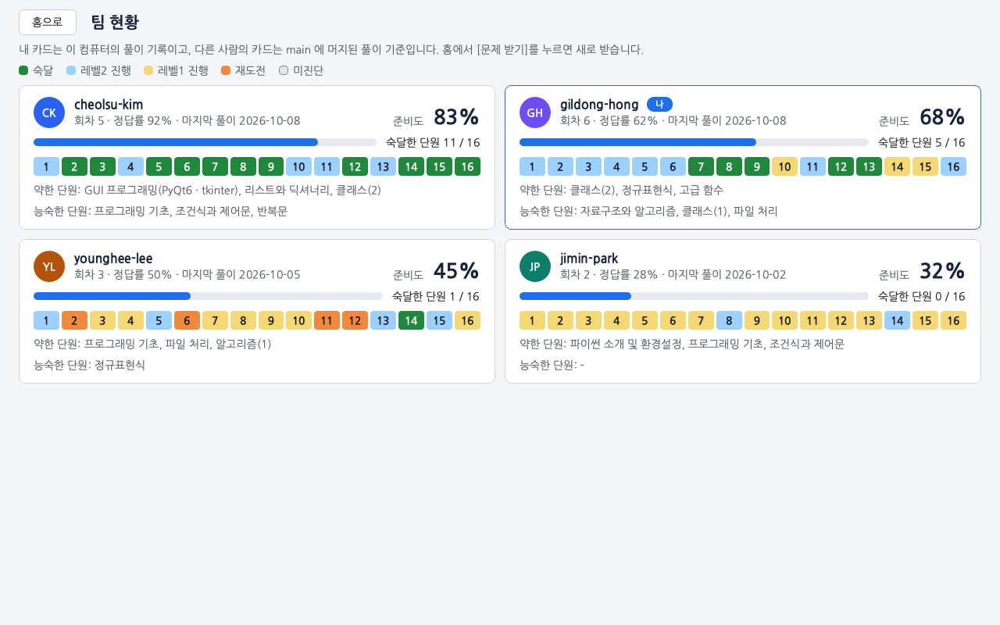

#  ROKEY 파이썬 스터디

ROKEY 11기 파이썬 교과목 평가(10/16)를 같이 준비하려고 만든 프로그램입니다. 실행하면 창이 열리고 문제 풀이, 채점, 해설 확인, 제출을 그 안에서 합니다.


## 시험 정보

| 항목 | 내용 |
|---|---|
| 일시 | 10/16(금) 14:30 ~ 16:30, 프로그래머스 |
| 범위 | 강의 자료 + 주간 요약본 |
| 유형 | 빈칸 채우기, 반환값 문제, 출력 문제, 객관식 |
| 채점 | 부분 점수가 없고, 요구한 형식과 정확히 같아야 정답입니다 |
| 금지 | IDE, VSCode, 파이썬 레퍼런스, 메모, 검색 (실행하기 버튼만 가능) |

프로그램 화면은 시험과 비슷하게 맞췄습니다. 왼쪽에 문항 목록, 가운데에 문제, 오른쪽에 답안이 있고 자동완성과 문법 강조는 없습니다. 복사, 붙여넣기, 우클릭 메뉴도 막아 두었습니다.

## 처음 한 번 준비하기

- 파이썬 3.10~3.14(64비트)가 필요합니다. 새로 설치한다면 [3.14](https://www.python.org/downloads/latest/python3.14/)를 고릅니다. 3.15 에는 PyQt6 가 아직 설치되지 않습니다. 이미 설치돼 있으면 아래 1번처럼 터미널을 열고 `python --version` 으로 버전을 확인합니다.
- git 도 필요합니다. Windows 는 [Git for Windows](https://git-scm.com/download/win)를 설치합니다.
- 깃허브 ID 를 스터디장에게 알려 주고, GitHub 알림이나 메일로 온 저장소 초대를 수락합니다.

그다음 저장소를 받아 실행합니다. 터미널에서 쓰던 예전 버전을 받아 둔 폴더가 있으면 새로 받지 않고 [안 될 때](#안-될-때)의 네 줄 명령으로 새 버전을 받은 뒤 3번부터 합니다.

1. 프로그램을 둘 폴더를 탐색기로 열고 주소 칸에 `cmd` 를 입력한 뒤 Enter 를 누릅니다. 그 폴더에서 터미널(검은 창)이 열립니다. macOS 는 터미널 앱을 엽니다.
2. 아래 명령을 입력합니다. `rokey-python-study` 폴더가 생깁니다.

   ```bash
   git clone https://github.com/WaterMinCho/rokey-python-study.git
   ```

3. `rokey-python-study` 폴더의 `start.bat`(macOS 는 `start.command`)을 더블클릭합니다. 검은 창이 먼저 열리고 이어서 프로그램 창이 열립니다. 검은 창을 닫으면 프로그램도 닫힙니다.
4. 검은 창에 "설치할까요? [y/N]"이 나오면 `y` 를 입력하고 Enter 를 누릅니다. 화면을 그리는 PyQt6 를 `~/.rokey-study/venv` 에 설치하는데, 내려받는 양이 85MB 쯤이고 설치하면 250MB 쯤 됩니다. 수업 때 PyQt6 를 설치했다면 묻지 않습니다.
5. 프로그램 창이 열리면 깃허브 ID(github.com/ 뒤에 나오는 이름)를 입력하고 [시작]을 누릅니다.
6. 홈 화면의 [진단 테스트 시작]을 누릅니다. 32문항이고 30분쯤 걸립니다. 모르는 문항은 비워 두고 제출해도 됩니다.

이 문서에 나오는 터미널 명령은 `start.bat` 이 있는 폴더에서 입력합니다. 탐색기로 그 폴더를 열고 주소 칸에 `cmd` 를 입력하면 터미널이 열립니다. `python` 이 실행되지 않으면 Windows 는 `py`, macOS 는 `python3` 로 바꿔 입력합니다(예: `py study.py update`).

## 문제 풀기

다음부터는 `start.bat`(macOS 는 `start.command`)을 더블클릭해 켭니다. 켤 때마다 새 문제와 프로그램 새 버전을 받아 오고, 홈의 [문제 받기]를 눌러도 똑같이 받습니다. 프로그램이 바뀌었으면 '프로그램 갱신' 창이 뜨고, [다시 시작]을 누르면 새 버전으로 다시 열립니다.

홈의 '지금 할 일' 버튼([3회차 시작]처럼 나옵니다)을 누르면 이번 회차가 열립니다. 화면에 '3회차 미니 모의고사'라고 나오는 것이 회차입니다. 120분짜리 실전 모의고사는 아래 '모의고사 보기'대로 터미널에서 따로 봅니다.


- 답은 적는 대로 저장됩니다. 창을 닫아도 다음에 이어서 풉니다.
- 답을 적은 문항은 왼쪽 목록에서 초록 동그라미로 바뀝니다. 맞았는지는 회차를 제출해야 나옵니다.
- 코드 문항의 [코드 실행]은 문제에 나온 예시만 돌립니다. 시험의 '실행하기'와 같고, 눌러도 기록되지 않습니다.
- 다 풀면 [회차 제출]을 누릅니다. 이때 채점하고 결과를 내 컴퓨터에 기록합니다. 안 푼 문항은 오답이 됩니다. GitHub 에 올리는 것은 [제출(PR 올리기)]로 따로 합니다.
- 결과 화면에서 점수와 단원별 판정을 보고, 문항을 골라 [해설 보기]로 정답과 해설을 봅니다. 해설은 회차를 제출한 뒤에 열립니다.
- 틀린 문항은 [다시 풀기]로 고친 뒤 [다시 채점]을 눌러 볼 수 있습니다. 다시 채점한 점수는 단원 판정에 들어가지 않고 첫 제출만 들어갑니다.


글자 크기는 Ctrl(맥은 Cmd)과 `+`, `-`, `0` 으로 바꿉니다. 홈 오른쪽 위의 테마 버튼([테마: 시스템]처럼 나옵니다)을 누를 때마다 시스템, 밝게, 어둡게 순서로 바뀌고, 시스템은 운영체제 설정을 따릅니다.



## 답 적는 법과 채점

| 유형 | 답 적는 법 | 채점 |
|---|---|---|
| 객관식 | 보기 카드를 누르거나 숫자 키로 고릅니다. "모두 고르세요" 문항은 여러 개를 고릅니다 | 고른 보기가 정답과 정확히 같아야 합니다 |
| 출력 예측 | 실행하면 화면에 찍히는 글자를 똑같이 적습니다. 답을 따옴표로 감싸지 않고, `['a', 'b']` 처럼 출력에 찍히는 따옴표만 적습니다 | 글자 단위로 같아야 합니다 |
| 단답 | 따옴표로 감싸지 않고 한 줄로 적습니다 | 대소문자까지 같아야 합니다. 대소문자나 띄어쓰기를 가리지 않는 문항이 몇 개 있습니다 |
| 빈칸 채우기 | 코드의 `____` 자리만 채웁니다 | 빈칸 밖을 고치면 오답입니다 |
| 반환값 | `solution` 함수를 완성합니다 | 반환값이 자료형까지 같아야 합니다(3 과 3.0 은 다른 값) |
| 출력 | 프로그램을 작성합니다 | 출력이 글자 단위로 같아야 합니다 |

- 시험처럼 부분 점수가 없어서, 코드 문항(빈칸 채우기, 반환값, 출력)은 테스트를 전부 통과해야 점수를 받습니다.
- 출력을 비교할 때 줄 끝 공백과 맨 끝 빈 줄은 무시합니다.
- `input("안내 문구")` 의 안내 문구는 출력으로 치지 않습니다.
- 한 문제는 5초 안에 끝나야 합니다.

## 풀이 올리기(PR)와 리뷰

홈이나 결과 화면의 [제출(PR 올리기)]를 누르면 내 풀이 폴더(`submissions/<내 ID>/`)가 GitHub 의 `study/<내 ID>` 브랜치로 올라가고 브라우저에 PR 페이지가 열립니다. PR(Pull Request)은 내 풀이를 저장소에 합쳐 달라고 올리는 글이고, 팀원이 여기에 코멘트를 답니다. 조금 지나면 PR 에 단원별 상태와 약한 개념이 코멘트로 달립니다.

- 처음 누를 때 GitHub 로그인을 한 번 합니다. Windows 는 브라우저 로그인 창이 뜨고, macOS 는 [docs/GIT_GUIDE.md](docs/GIT_GUIDE.md)의 순서대로 미리 설정합니다.
- 더 풀고 다시 누르면 같은 PR 에 이어서 올라갑니다.
- 스터디 시간에 서로의 PR 을 보고 약한 단원을 설명해 줍니다. 리뷰가 끝나면 스터디장이 Squash and merge 를 눌러 PR 을 저장소에 합칩니다(머지).
- PR 이 머지되면 아래 학습 현황판과 프로그램의 [팀 현황] 화면이 바뀝니다.

로그인 설정, 제출이 안 될 때 확인할 것, PR 에서 피드백하는 방법은 [docs/GIT_GUIDE.md](docs/GIT_GUIDE.md)에 있습니다.


[현황판을 표로 보기](https://github.com/WaterMinCho/rokey-python-study/blob/dashboard/DASHBOARD.md)

홈 오른쪽 위의 [팀 현황]을 누르면 팀원들의 준비도와 단원별 상태가 카드로 나옵니다. 내 카드는 이 컴퓨터의 풀이 기록입니다. 다른 사람의 카드는 main 에 머지된 풀이 기준이고, 프로그램을 켤 때와 홈의 [문제 받기]를 누를 때 새로 받습니다.



## 문제를 고르는 방식

- 진단 테스트로 단원(차시)마다 출발 레벨을 정합니다. 레벨은 1 기본, 2 응용, 3 심화입니다.
- 회차마다 전 단원에서 8~18문항을 섞어 냅니다. 약한 단원이 더 자주 나오고, 틀린 문항은 2회차 뒤에 다시 나옵니다.
- 한 레벨에서 푼 문항이 2~3개면 전부 맞혀야 하고, 4개 이상이면 최근 4문항 중 3문항 이상을 맞혀야 다음 레벨로 올라갑니다.
- 레벨2를 통과한 단원을 숙달로 칩니다. 홈의 시험 준비도는 단원별 상태를 0~100 으로 합친 값입니다.
- 클래스 1·2, GUI, 예외 처리, 정규표현식 단원(9·10·11·13·14차시)은 추첨 가중치가 1.5배라 더 자주 나옵니다.

규칙과 숫자 전체는 [docs/CRITERIA.md](docs/CRITERIA.md)에 있습니다.

## 모의고사 보기

실전 모의고사는 2회(`m1`, `m2`)가 있고 각각 120분, 100점입니다. 화면이 아니라 터미널에서 봅니다. 전 단원을 숙달한 뒤에 보기를 권하지만 그 전에도 받을 수 있습니다. 아래는 1회 기준이고, 2회는 `m1` 자리에 `m2` 를 씁니다.

1. `python study.py start m1` 을 실행합니다. 이때부터 120분을 잽니다. 남은 시간은 보여 주지 않으니 시계를 봅니다.
2. 문제지는 `problems/m1/quiz.md` 와 `problems/m1/p01/problem.md` 같은 파일이고, 답은 `submissions/<내 ID>/m1/` 의 `quiz.py` 와 `p01.py` 같은 파일에 적습니다. 파일은 메모장 같은 편집기로 엽니다.
3. `quiz.py` 는 화면과 달리 파이썬 값으로 적습니다. 객관식은 숫자(`Q1 = 3`), 출력 예측과 단답은 따옴표로 감싼 글자(`Q17 = "답"`), 여러 줄 출력은 `"""` 로 감쌉니다. 같은 안내가 `quiz.py` 맨 위에도 적혀 있습니다.
4. `python study.py grade m1` 로 채점합니다. 틀린 문항의 해설은 `python study.py explain m1 Q3` 처럼 봅니다.
5. 프로그램의 [제출(PR 올리기)]를 누르면 모의고사 풀이도 같이 올라갑니다.

## 폴더와 차시별 복습 자료

회차는 여러 차시를 섞어서 냅니다. 차시별로 복습하려면 `problems/s03/README.md` 처럼 차시 폴더의 `README.md` 를 엽니다. 개념 정리와 시험에서 헷갈리는 부분이 적혀 있습니다.

| 폴더 | 내용 |
|---|---|
| `problems/s01` ~ `s16` | 1~16차시. 파이썬 소개, 프로그래밍 기초, 조건문, 리스트와 딕셔너리, 반복문, 함수 1·2, 자료구조와 알고리즘, 클래스 1·2, GUI, 파일 처리, 예외·문자열·람다·map, 정규표현식, 고급 함수, 알고리즘 1 |
| `problems/m1`, `m2` | 모의고사 1회, 2회. 각각 120분, 100점 |
| `problems/c1`, `c2` | 코딩테스트 연습 Lv.1, Lv.2 (선택) |
| `submissions/<내 ID>` | 내 회차, 풀이, 기록(`profile.json`) |
| `docs` | [GIT_GUIDE](docs/GIT_GUIDE.md)(제출과 피드백), [CRITERIA](docs/CRITERIA.md)(판정 규칙), [AUTHORING](docs/AUTHORING.md)(스터디장용 운영 메모와 출제 규격) |

## 안 될 때

### 창이 열리지 않을 때

창이 열리지 않고 오류만 나오면 터미널에서 `python study.py update` 를 실행해 새 버전을 받은 뒤 다시 켭니다. `update` 가 오류로 끝나면 바로 아래의 네 줄을 입력합니다.

### 예전 버전을 받아 뒀거나 문제 받기가 계속 오류로 끝날 때

터미널에서 쓰던 예전 버전을 받아 뒀거나(폴더에 `start.bat` 이 없습니다), 프로그램을 켤 때마다 "문제를 받다가 오류가 났습니다"가 나오면 `rokey-python-study` 폴더에서 아래 네 줄을 따옴표까지 똑같이 차례로 입력한 뒤 프로그램을 켭니다.

```bash
git fetch origin main
git reset -q FETCH_HEAD
git checkout -q -- ":(top)" ":(top,exclude)submissions"
git clean -fdq ":(top)problems"
```

새로 clone 하지 않아도 되고, 풀이 폴더(`submissions`)는 바뀌지 않아서 풀던 기록이 새 프로그램에서 이어집니다.

### ID 를 잘못 넣었을 때

프로그램을 끄고 `submissions/<잘못 넣은 ID>` 폴더 이름을 맞는 ID 로 바꾼 뒤, 터미널에서 `python study.py init <맞는 ID>` 를 실행합니다. 다시 켜면 풀던 기록이 이름을 바꾼 폴더에서 이어집니다. 잘못된 ID 로 이미 제출했다면 그 PR 은 스터디장에게 닫아 달라고 하세요.

### 제출이 안 될 때

프로그램이 띄운 안내마다 확인할 것을 [docs/GIT_GUIDE.md](docs/GIT_GUIDE.md#제출이-안-될-때)에 적어 두었습니다.

### 그 밖에 불편하거나 이상할 때

저장소의 Issues → New issue 에서 양식을 골라 적습니다.

| 양식 | 적을 것 |
|---|---|
| 사용이 불편하거나 오류가 납니다 | 프로그램이 안 되거나 설명이 헷갈릴 때 씁니다. 오류 창이 뜨면 [오류 내용 복사]를 눌러 붙여 넣습니다 |
| 문제나 정답이 이상합니다 | 문항 ID(예: `s03_Q4`)와 무엇이 이상한지 적습니다 |
| 문제를 더 만들어 주세요 | 더 연습하고 싶은 단원이나 개념을 적습니다 |

이슈를 쓰면 스터디장에게 알림이 가고, 처리되면 이슈가 닫히면서 알림이 옵니다.

## 터미널 명령

창 없이 풀려면 `go` 를 씁니다. 답은 `submissions/<내 ID>/<회차>/` 의 `quiz.py` 와 `.py` 파일에 직접 적습니다.

`go` 는 적어 둔 답을 채점해 첫 제출로 기록합니다(채점 전에 한 번 묻습니다). 화면에서 풀던 회차에 쓰면 쓰다 만 답까지 기록되므로, 화면으로 풀 때는 화면의 [회차 제출]만 씁니다. 터미널 모드는 빈 문항을 오답으로 넘기지 않아서, 모든 문항에 답을 적어야 회차가 끝나고 다음 회차가 나옵니다.

| 명령 | 하는 일 |
|---|---|
| `python study.py` | 창 열기. `start.bat` 을 더블클릭한 것과 같습니다 |
| `python study.py update` | 새 버전과 새 문제 받기 (창이 열리지 않을 때) |
| `python study.py go` | 다음 할 일 이어 가기 (진단, 풀기, 채점, 다음 회차) |
| `python study.py me` | 단원별 숙달도와 약한 개념 |
| `python study.py explain s03_Q4` | 정답과 해설 |
| `python study.py grade r02` | 2회차(`r02`) 다시 채점 |
| `python study.py start m1` | 실전 모의고사(120분). 채점은 `grade m1`. 2회는 `m2` |
| `python study.py start c1` | 코딩테스트 연습 Lv.1. 채점은 `grade c1`. Lv.2 는 `c2` |

## 라이선스

프로그램 코드(`study.py`, `adaptive.py`, `session.py`, `gitflow.py`, `bootstrap.py`, `mdlite.py`, `gui/`, `tools/`, `tests/`)는 [GPL-3.0](LICENSE)입니다. 화면에 쓰는 PyQt6 가 GPL-3.0 이라 같은 조건을 따릅니다.

`gui/fonts/` 의 나눔고딕 글꼴은 [SIL OFL 1.1](gui/fonts/OFL.txt)을 따릅니다.

`problems/` 의 문제, 해설, 개념 정리는 이 스터디의 학습 자료이고 GPL 적용 대상이 아닙니다. 다른 곳에 옮겨 쓰려면 스터디장에게 문의해 주세요.
