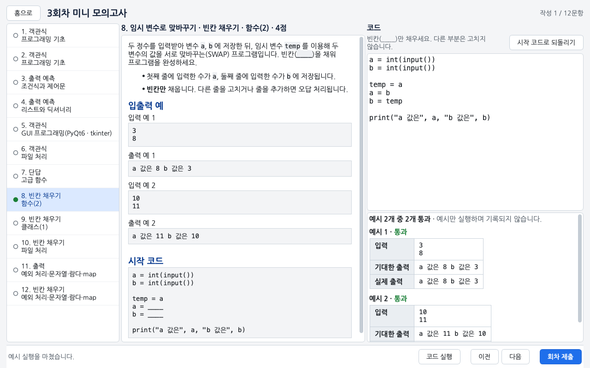
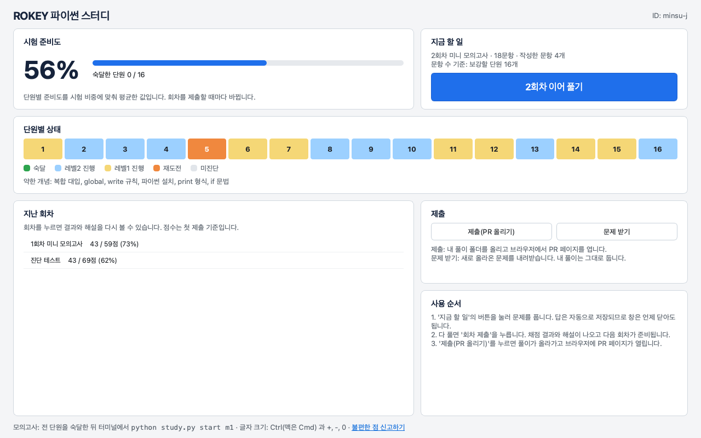
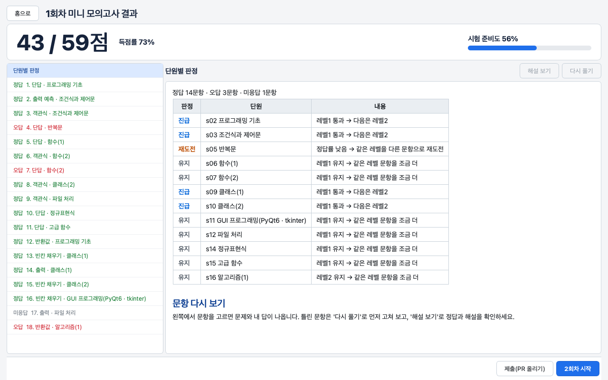
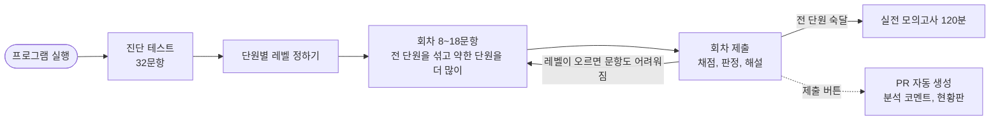

# ROKEY 파이썬 스터디

ROKEY 11기 파이썬 교과목 평가(10/16)를 같이 준비하려고 만든 프로그램입니다. 실행하면 창이 열리고 문제 풀이, 채점, 해설 확인, 제출을 그 안에서 합니다.



## 학습 현황판


풀이가 main 에 합쳐지면 자동으로 바뀝니다. [표로 보기](https://github.com/WaterMinCho/rokey-python-study/blob/dashboard/DASHBOARD.md)

## 시험은 이렇게 나옵니다

| 항목 | 내용 |
|---|---|
| 일시 | 10/16(금) 14:30 ~ 16:30, 프로그래머스 |
| 범위 | 강의 자료 + 주간 요약본 |
| 유형 | 빈칸 채우기, 반환값 문제, 출력 문제, 객관식 |
| 채점 | 부분 점수 없음. 요구한 형식과 정확히 같아야 정답 |
| 금지 | IDE, VSCode, 파이썬 레퍼런스, 메모, 검색 (실행하기 버튼만 가능) |

화면을 시험과 비슷하게 맞췄습니다. 왼쪽에 문제, 오른쪽에 답안이 있고 자동완성과 문법 강조는 없습니다.

## 처음 실행하기

파이썬 3.10~3.14(64비트)와 git 이 필요합니다. 버전은 `python --version` 으로 확인하세요.

1. 저장소 초대를 수락합니다. GitHub 알림이나 메일로 옵니다.
2. 저장소를 받습니다.

   ```bash
   git clone https://github.com/WaterMinCho/rokey-python-study.git
   ```

3. 폴더 안의 `start.bat`(Windows)이나 `start.command`(macOS)를 더블클릭합니다. 터미널에서는 `python study.py` 입니다.
4. PyQt6 가 없으면 설치할지 묻습니다. `y` 를 누르면 `~/.rokey-study/venv` 에 설치하는데, 내려받는 양이 85MB 쯤이고 설치하면 250MB 쯤 됩니다. 수업 때 설치했다면 묻지 않습니다.
5. 창이 열리면 깃허브 ID 를 입력합니다. 진단 테스트 32문항이 나오고 30분쯤 걸립니다.

ID 를 잘못 넣었으면 프로그램을 끄고 `submissions/<잘못 넣은 ID>` 폴더 이름을 맞는 ID 로 바꾼 뒤, 터미널에서 `python study.py init <맞는 ID>` 를 실행하세요. 다시 켜면 풀던 기록이 이름을 바꾼 폴더에서 이어집니다. 잘못된 ID 로 이미 제출했다면 그 PR 은 스터디장에게 닫아 달라고 하세요.

파이썬을 새로 깔 때는 [3.14](https://www.python.org/downloads/latest/python3.14/)를 고르세요. 10/9 에 나오는 3.15 에는 PyQt6 가 아직 설치되지 않습니다.

### 예전 버전을 받아 뒀거나 문제 받기가 계속 오류로 끝날 때

터미널에서 쓰던 예전 버전을 받아 뒀거나, 프로그램을 켤 때마다 "문제를 받다가 오류가 났습니다"가 나오면 그 폴더에서 아래 네 줄을 차례로 실행한 뒤 프로그램을 켜세요. 새로 clone 하지 않아도 되고, 풀이 폴더(`submissions`)는 건드리지 않아서 풀던 기록이 새 프로그램에서 이어집니다.

```bash
git fetch origin main
git reset -q FETCH_HEAD
git checkout -q -- . ":(exclude)submissions"
git clean -fdq problems
```

## 문제 풀기

프로그램을 켜면 새 문제를 받아 오고, 홈의 큰 버튼을 누르면 이번 회차가 열립니다.



- 답은 적는 대로 저장됩니다. 창을 닫아도 다음에 이어서 풉니다.
- 객관식은 번호 버튼을 누릅니다. 출력 예측은 실행하면 화면에 찍히는 글자를 그대로 적고(답을 따옴표로 감싸지는 않지만, `['a', 'b']` 처럼 출력에 찍히는 따옴표는 적습니다), 단답은 따옴표로 감싸지 않고 한 줄로 적습니다.
- 코드 문항의 [코드 실행]은 문제에 나온 예시만 돌립니다. 시험의 '실행하기'와 같고, 눌러도 기록되지 않습니다.
- 다 풀면 [회차 제출]을 누릅니다. 이때 채점하고, 안 푼 문항은 오답이 됩니다.
- 결과 화면에서 점수와 단원별 판정, 문항별 해설을 봅니다. 틀린 문항은 고쳐서 다시 채점해 볼 수 있는데, 숙달 판정에는 처음 제출한 답만 들어갑니다.



글자 크기는 Ctrl(맥은 Cmd)과 `+`, `-`, `0` 으로 바꿉니다.

## 문제는 어떻게 골라 주나요



- 진단 테스트로 단원(차시)마다 출발 레벨을 정합니다. 레벨은 1 기본, 2 응용, 3 심화입니다.
- 회차마다 전 단원에서 8~18문항을 섞어 냅니다. 약한 단원이 더 자주 나오고, 문항 수는 보강할 단원 수와 직전 회차 점수로 정합니다.
- 한 레벨에서 최근 2문항을 다 맞히거나 4문항 중 3문항을 맞히면 다음 레벨로 올라갑니다. 레벨2를 통과한 단원은 숙달로 칩니다.
- 틀린 문항은 2회차 뒤에 다시 나옵니다.
- 상속, GUI, 예외 처리, 정규표현식 단원은 다른 단원보다 1.5배 자주 나옵니다.
- 모든 단원을 숙달하면 실전 모의고사(120분, 100점)를 풉니다.

판정 규칙과 숫자 전체는 [docs/CRITERIA.md](docs/CRITERIA.md)에 있습니다.

## 제출하기

홈이나 결과 화면의 [제출(PR 올리기)]를 누르면 `submissions/<내 ID>/` 폴더가 `study/<내 ID>` 브랜치로 올라가고 PR 이 만들어집니다. 조금 지나면 PR 에 단원별 상태와 약한 개념이 코멘트로 달립니다.

- 더 풀고 다시 누르면 같은 PR 에 이어서 올라갑니다.
- 스터디 시간에 서로의 PR 을 보고 약한 단원을 설명해 준 뒤 Squash and merge 합니다. 합쳐지면 현황판이 바뀝니다.
- 처음 제출할 때 GitHub 로그인을 한 번 합니다. Windows 는 브라우저 로그인 창이 뜨고, macOS 는 [docs/GIT_GUIDE.md](docs/GIT_GUIDE.md)의 순서대로 설정합니다.

PR 에서 서로 피드백하는 방법도 같은 문서에 있습니다.

## 채점 규칙

| 유형 | 답하는 방법 | 채점 |
|---|---|---|
| 객관식 | 번호 버튼 (복수 정답 문항은 여러 개) | 정답과 정확히 일치 |
| 출력 예측 | 출력될 내용을 그대로 | 글자 단위로 일치 |
| 단답 | 한 줄 | 정확히 일치(대소문자 구분) |
| 빈칸 채우기 | 코드의 `____` 자리만 | 빈칸 밖을 고치면 오답. 테스트 전부 통과 |
| 반환값 | `solution` 함수 완성 | 반환값과 자료형까지 일치 (3 과 3.0 은 다른 값) |
| 출력 | 프로그램 작성 | 출력이 글자 단위로 일치 |

- 테스트를 전부 통과해야 점수를 받습니다. 부분 점수는 없습니다.
- 출력을 비교할 때 줄 끝 공백과 맨 끝 빈 줄은 무시합니다.
- `input("안내 문구")` 의 안내 문구는 출력으로 치지 않습니다.
- 한 문제는 5초 안에 끝나야 합니다.
- 해설은 회차를 제출해야 열립니다.

## 문제 은행

| 세트 | 내용 |
|---|---|
| `s01` ~ `s16` | 1~16차시. 파이썬 소개, 프로그래밍 기초, 조건문, 리스트와 딕셔너리, 반복문, 함수 1·2, 자료구조와 알고리즘, 클래스 1·2, GUI, 파일 처리, 예외·문자열·람다·map, 정규표현식, 고급 함수, 알고리즘 1 |
| `m1` | 모의고사 1회. 120분, 100점 |
| `c1`, `c2` | 코딩테스트 연습 Lv.1, Lv.2 (선택) |

회차는 여러 차시를 섞어서 냅니다. 차시별로 복습하려면 각 차시 폴더의 `README.md` 를 보세요. 개념 정리와 시험에서 헷갈리는 부분을 적어 뒀습니다. 강의 자료(PDF)는 저작물이라 저장소에 넣지 않았습니다.

## 터미널로 쓰기

창 없이 쓰려면 `go` 를 붙입니다. 답은 `submissions/<내 ID>/<회차>/` 의 `quiz.py` 와 `.py` 파일에 직접 적습니다.

`go` 는 적어 둔 답을 채점해 첫 시도로 기록합니다(채점 전에 한 번 묻습니다). 화면에서 풀던 회차가 있으면 쓰다 만 답까지 기록되니, 화면으로 풀 때는 화면의 [회차 제출]만 쓰세요.

| 명령 | 하는 일 |
|---|---|
| `python study.py go` | 다음 할 일 이어 가기 (진단, 풀기, 채점, 다음 회차) |
| `python study.py me` | 단원별 숙달도와 약한 개념 |
| `python study.py explain s03_Q4` | 정답과 해설 |
| `python study.py grade r02` | 지난 회차 다시 채점 |
| `python study.py start m1` | 실전 모의고사(120분). 채점은 `grade m1` |
| `python study.py start c1` | 코딩테스트 연습. 채점은 `grade c1` |
| `python study.py analyze` | 전원 학습 분석 |

### 모의고사 보기

모의고사(`m1`)는 화면이 아니라 터미널에서 봅니다.

1. `python study.py start m1` 을 실행합니다. 이때부터 120분을 잽니다(남은 시간은 따로 보여 주지 않으니 시계를 보세요).
2. 문제지는 `problems/m1/quiz.md` 와 `problems/m1/p01/problem.md` 같은 파일이고, 답은 `submissions/<내 ID>/m1/` 의 `quiz.py` 와 `p01.py` 같은 파일에 적습니다.
3. `quiz.py` 는 화면과 달리 파이썬 값으로 적습니다. 객관식은 숫자(`Q1 = 3`), 출력 예측과 단답은 따옴표로 감싼 글자(`Q18 = "key"`), 여러 줄 출력은 `"""` 로 감쌉니다.
4. `python study.py grade m1` 로 채점합니다.

## 폴더 구조

```
start.bat, start.command   더블클릭 실행
study.py                 실행기, 터미널 명령, 문제 은행 로딩과 채점
bootstrap.py             PyQt6 확인과 설치
gui/                     화면 (PyQt6)
session.py               화면과 터미널이 같이 쓰는 서비스 계층
adaptive.py              단원별 숙달도, 회차 구성, 준비도
gitflow.py               문제 받기와 제출
mdlite.py                문제 본문(마크다운)을 화면용으로 변환
problems/<세트>/         문제 은행
submissions/<내 ID>/     내 회차, 풀이, profile.json
docs/                    GIT_GUIDE(제출과 피드백), CRITERIA(판정 규칙), AUTHORING(출제 규격)
tools/, tests/           출제와 CI 에 쓰는 도구, 테스트
```

정답과 해설은 `problems/<세트>/sealed.json` 에 묶어 뒀습니다. 실수로 미리 보지 않게 가린 것이고 암호화는 아닙니다.

## 불편하거나 이상하면

창이 열리지 않고 오류만 나오면 터미널에서 `python study.py update` 를 실행해 새 버전을 받은 뒤 다시 켜 보세요.

저장소의 Issues → New issue 에서 양식을 골라 적어 주세요. 오류 창이 뜨면 [오류 내용 복사]로 붙여 넣고, 문제가 이상하면 문항 ID(예: `s03_Q4`)를 적어 주세요.

## 스터디장 메모

- 스터디원 초대는 저장소 Settings → Collaborators 에서 합니다.
- 문항이 모자라면 Actions 가 "출제 요청" 이슈를 만들거나 고칩니다. 이슈의 표대로 문제를 추가하면 다음 실행부터 회차에 들어갑니다.
- 문제를 추가하거나 고치는 방법은 [docs/AUTHORING.md](docs/AUTHORING.md)에 있습니다. 커밋 전에 `python tools/verify_bank.py` 와 `python tools/seal.py check` 를 돌립니다.
- 문제나 도구는 별도 브랜치에서 고칩니다. `main` 이나 `study/<ID>` 브랜치에서 풀이 폴더 밖의 파일을 고친 채 프로그램을 켜면, 문제 받기가 그 수정을 `.git/study-backup/` 에 복사하고 되돌립니다.
- main 은 PR 로만 바뀝니다. 머지 방식은 Squash 만 켜 뒀고, 머지되면 브랜치가 지워집니다.

## 라이선스

프로그램 코드(`study.py`, `adaptive.py`, `session.py`, `gitflow.py`, `bootstrap.py`, `mdlite.py`, `gui/`, `tools/`, `tests/`)는 [GPL-3.0](LICENSE)입니다. 화면에 쓰는 PyQt6 가 GPL-3.0 이라 같은 조건을 따릅니다.

`problems/` 의 문제, 해설, 개념 정리는 이 스터디의 학습 자료이고 GPL 적용 대상이 아닙니다. 다른 곳에 옮겨 쓰려면 스터디장에게 문의해 주세요.
