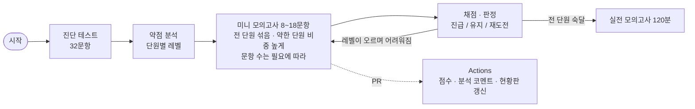

# ROKEY 파이썬 스터디

ROKEY 11기 **파이썬 교과목 평가(10/16)** 를 스터디원 모두가 잘 보기 위한 저장소입니다.
한 명 한 명의 결과에 맞춰 다음 문제를 골라 주는 **맞춤 학습 도구**와 1~16차시 문제 은행이 들어 있습니다.
매 회차가 전 단원을 섞은 **미니 모의고사**이고, 문항 수와 난이도는 그 사람의 상태에 맞춰 정해집니다.

- 명령은 하나입니다. `python study.py` 를 치면 지금 할 일을 이어서 줍니다.
- 설치할 것 없음(파이썬만). 채점은 내 컴퓨터에서 바로, PR 을 올리면 GitHub Actions 가 한 번 더 채점하고 학습 분석을 남깁니다.

## 학습 현황판


사람별 진도·숙달 단원·약한 단원·약한 개념. main 에 풀이가 올라올 때마다 자동 갱신됩니다. [표로 보기](https://github.com/WaterMinCho/rokey-python-study/blob/dashboard/DASHBOARD.md)

## 평가 조건 요약

| 항목 | 내용 |
|---|---|
| 일시 | 10/16(금) 14:30 ~ 16:30, 프로그래머스 |
| 범위 | 강의 자료 + 주간 요약본 |
| 유형 | 빈칸 채우기, 반환값 문제, 출력 문제, 객관식 |
| 채점 | **부분 점수 없음**, 요구한 형식과 정확히 일치해야 정답 |
| 금지 | IDE·VSCode·파이썬 레퍼런스·메모·검색 (실행하기 버튼만 가능) |

그래서 문제는 **코드를 눈으로 읽고 머리로 실행하기**와 **형식을 정확히 맞추기**를 연습하도록 만들었습니다.

## 역할

| 누가 | 하는 일 |
|---|---|
| 스터디장 | 스터디원을 저장소에 초대한다(Settings → Collaborators). 새 차시 자료가 나오면 문제 세트를 추가한다. |
| 스터디원 | `python study.py` 로 자기 속도에 맞게 풀고, 원하면 PR 로 올려 점수와 분석을 공유한다. |

강의 자료(PDF)는 저작물이라 저장소에 넣지 않았습니다. 저장소에는 문제와 차시별 개념 정리만 있습니다.

## 처음 한 번 (5분)

```bash
git clone https://github.com/WaterMinCho/rokey-python-study.git
cd rokey-python-study
python study.py
```

처음 실행하면 깃허브 ID 를 묻고, 바로 **진단 테스트**(32문항, 약 30분)를 만들어 줍니다.
`python` 명령이 없으면 `python3` 로 실행하세요. git 이 처음이면 [docs/GIT_GUIDE.md](docs/GIT_GUIDE.md) 를 따라 하면 됩니다.

## 매일 하는 일

```bash
git pull            # 새 문제·세트 받기
python study.py     # 지금 할 일 이어 가기
```

`python study.py` 가 상황에 따라 알아서 합니다.

| 상황 | 하는 일 |
|---|---|
| 처음 | 진단 테스트를 만들어 준다 → `submissions/<내 ID>/d1/README.md` 가 문제지 |
| 회차를 풀던 중 | 채점하고, 아직 안 푼 문항 수를 알려 준다 |
| 회차를 다 풀었음 | 채점 → 단원별 판정(진급 / 유지 / 재도전) → **다음 회차 미니 모의고사**를 만들어 준다 |
| 전 단원 숙달 | 실전 모의고사(120분)를 권하고, 계속하면 심화 회차가 이어진다 |

문제지는 회차 폴더(`submissions/<내 ID>/r01/` 등)의 `README.md` 에 모아 두었으니, 그 폴더 안에서 `quiz.py` 에 퀴즈 답을 적고 `.py` 파일을 고치면 됩니다.
퀴즈는 **실행하지 말고** 눈으로 풉니다. 틀린 문항은 해설을 보기 전에 한 번 더 생각해 보고, 그래도 모르면 `python study.py explain s03_Q4` 처럼 봅니다.

### 한눈에 보기



### 맞춤 학습이 돌아가는 방식

- **단원** = 차시(1~16), **레벨** = 1 기본 · 2 응용 · 3 심화. 진단 테스트로 단원마다 출발 레벨을 정합니다(2문항 모두 맞히면 레벨2부터).
- 매 회차는 **전 단원을 섞은 미니 모의고사**입니다. 약한 단원일수록 자주 나오고, 숙달한 단원도 복습으로 가끔 나옵니다. 코드 문제가 약 40%, 나머지는 퀴즈입니다.
- 문항 수(8~18개)는 그 사람의 필요로 정합니다. 보강할 단원이 많으면 길고(단원당 1.5~2.5문항), 숙달 단원이 많으면 짧게 복습만 합니다. 직전 회차 득점률이 절반 아래면 짧게 끊어 자주 피드백하고, 90% 이상이면 조금 더 냅니다.
- 각 단원의 문항은 그 단원의 현재 레벨에서 나오므로, 레벨이 오를수록 회차 전체가 어려워집니다.
- 한 레벨에서 최근 2문항을 모두 맞히거나 4문항 중 3개 이상 맞히면 **다음 레벨로 진급**, 정답률이 절반 아래면 **같은 레벨을 다른 문항으로 재도전**합니다.
- 레벨2까지 통과하면 그 단원은 **숙달**. 숙달 단원이 절반을 넘으면 복습도 심화(레벨3) 문항으로 바뀝니다. 모든 단원이 숙달되면 실전 모의고사 `m1`(120분, 100점)을 권합니다.
- 결과가 다르니 사람마다 받는 문항이 다릅니다. 내 상태는 `submissions/<내 ID>/profile.json` 한 파일에 기록되고, PR 로 올라가면 CI 가 단원별 숙달도·약한 개념·부족한 문항을 분석해 코멘트로 남깁니다.
- 그 밖에 틀린 문항은 2회차 뒤 다시 나오고(오답 재출제), 오래 안 본 숙달 단원은 다시 나오며(간격 반복), 상속·GUI·예외 처리·정규표현식 단원은 더 자주 나옵니다(중요도 1.5). 자세한 숫자는 [docs/CRITERIA.md](docs/CRITERIA.md).
- **시험 준비도**(0~100)는 단원 준비도의 중요도 가중 평균입니다. 현황판과 `python study.py me` 에 표시됩니다.

## 명령어

| 명령 | 하는 일 |
|---|---|
| `python study.py` | 다음 할 일 이어 가기 (진단 → 풀기 → 채점 → 다음 회차) |
| `python study.py me` | 내 단원별 숙달도·약한 개념·다음 추천 |
| `python study.py explain s03_Q4` | 해설·정답 보기 (회차 문항 ID 그대로) |
| `python study.py grade r02` | 지난 회차 다시 채점 |
| `python study.py start m1` | 실전 모의고사 (120분 타이머) |
| `python study.py analyze` | 전원 학습 분석 (스터디장용) |

## 채점 규칙

| 유형 | 답하는 곳 | 채점 |
|---|---|---|
| 객관식 | `quiz.py` 에 `s03_Q1 = 3` (복수 정답은 `[1, 3]`) | 정답과 정확히 일치 |
| 출력 예측 | `quiz.py` 에 `"출력 내용"` (여러 줄은 `"""`) | 글자 단위로 일치 |
| 단답 | `quiz.py` 에 `"답"` | 정확히 일치(대소문자 구분) |
| 빈칸 채우기 | `.py` 파일의 `____` 자리 | 빈칸 외 수정 금지 + 테스트 전부 통과 |
| 반환값 | `solution` 함수 | 반환값과 **자료형**까지 일치 (3 ≠ 3.0) |
| 출력 | 프로그램 작성 | 출력이 글자 단위로 일치 |

- 테스트를 **전부** 통과해야 점수를 받습니다(부분 점수 없음). 출력 비교에서 무시하는 것은 줄 끝 공백과 맨 끝 빈 줄뿐입니다.
- `input("안내 문구")` 의 안내 문구는 채점 출력에 포함되지 않습니다. 한 문제의 실행 제한은 5초입니다.

## PR 로 제출하기 (권장)

```bash
git switch -c <내ID>/day3              # 브랜치 하나에 여러 회차를 담아도 됩니다
git add submissions/<내ID>
git commit -m "3회차까지"
git push -u origin <내ID>/day3
```

GitHub 에서 PR 을 만들면 자동 채점 결과와 **학습 분석**(단원별 상태, 약한 개념)이 코멘트로 달립니다([예시 PR](https://github.com/WaterMinCho/rokey-python-study/pull/1)).
스터디 시간에 서로의 분석을 보며 약한 단원을 설명해 주고, 머지합니다.
규칙: 내 폴더 `submissions/<내 ID>/` 안만 고치고, PR 하나에 한 사람 풀이만 담습니다(CI 가 검사). main 은 PR 로만 바뀝니다.

## 문제 은행

| 세트 | 내용 |
|---|---|
| `s01` ~ `s16` | 1~16차시 (파이썬 소개 → 프로그래밍 기초 → 조건문 → 리스트·딕셔너리 → 반복문 → 함수 1·2 → 자료구조와 알고리즘 → 클래스 1·2 → GUI → 파일 처리 → 예외·문자열·람다·map → 정규표현식 → 고급 함수 → 알고리즘 1) |
| `m1` | 모의고사 1회 — 120분, 100점 |
| `c1` · `c2` | 코딩테스트 연습 Lv.1 · Lv.2 (선택) |
| `s00` | 도구 사용법 연습 |

차시별로 통째로 풀지는 않습니다(회차마다 섞여서 나옵니다). 대신 각 차시 폴더의 `README.md` 는 그 차시 개념 정리와 시험에서 헷갈리기 쉬운 포인트라 복습용으로 좋습니다.
새 차시가 진행되면 세트가 추가되고, 다음 회차부터 자동으로 섞여 나옵니다.

## 스터디 시간 진행 예 (16:40~)

| 시간 | 내용 |
|---|---|
| 16:40 ~ 16:45 | `git pull`, `python study.py` 로 이번 회차 받기 |
| 16:45 ~ 17:25 | 각자 풀기 (퀴즈는 실행 금지) |
| 17:25 ~ 17:40 | `python study.py` 로 채점·판정, 틀린 문항 다시 풀기 |
| 17:40 ~ 18:00 | 서로 약한 단원 설명하기, 해설 확인, PR 제출 |

## 저장소 구조

```
study.py                 명령 도구 (진단·회차·채점·해설)
adaptive.py              맞춤 학습 엔진 (단원별 숙달도, 회차 구성, 가이드)
problems/<세트>/         문제 은행
submissions/<내 ID>/     내 회차·풀이·profile.json (여기만 수정)
docs/GIT_GUIDE.md        git 흐름 가이드
docs/AUTHORING.md        출제 규격 (문제 추가·수정 방법)
docs/CRITERIA.md         평가·선별 기준 (숙달 판정, 회차 구성, 준비도)
tools/                   출제자·CI 용 도구
.github/workflows/ci.yml 자동 채점·분석
```

정답·해설은 `problems/<세트>/sealed.json` 에 묶여 있습니다. 실수로 스포일러를 보지 않게 가려 둔 것이고 암호화는 아닙니다.

## 불편하거나 이상하면 이슈로

저장소 **Issues → New issue** 에서 양식을 골라 적어 주세요. 명령이 안 될 때는 터미널 출력을 그대로 붙이고, 문제가 이상할 때는 문항 ID(예: `s03_Q4`)를 적습니다.
자세한 방법과 PR 에서 서로 피드백하는 법은 [docs/GIT_GUIDE.md](docs/GIT_GUIDE.md) 에 그림으로 정리해 두었습니다.

## 스터디장용

- 스터디원 초대: 저장소 **Settings → Collaborators**
- 전원 학습 분석: `python study.py analyze` (main 에 풀이가 올라올 때마다 Actions 요약과 현황판에도 남습니다)
- main 은 보호되어 있어 PR 로만 바뀝니다(관리자는 직접 push 가능). 문항 부족·규칙 위반은 CI 가 알려 줍니다.
- 문항이 모자라면 Actions 가 **"출제 요청" 이슈**를 자동으로 만들거나 갱신합니다. 그 표대로 문제를 추가하면 다음 `git pull` 부터 회차에 포함됩니다.
- 문제 추가·수정: [docs/AUTHORING.md](docs/AUTHORING.md). 커밋 전 `python tools/verify_bank.py`, `python tools/seal.py check`.

## 라이선스

- 프로그램 코드(`study.py`, `adaptive.py`, `session.py`, `gitflow.py`, `bootstrap.py`, `mdlite.py`, `gui/`, `tools/`, `tests/`)는 [GPL-3.0](LICENSE)입니다. 화면에 쓰는 PyQt6 가 GPL-3.0 이라 같은 조건을 따릅니다.
- `problems/` 의 문제·해설·개념 정리는 이 스터디의 학습 자료이며 GPL 적용 대상이 아닙니다. 다른 곳에 옮겨 쓰려면 스터디장에게 문의해 주세요.
