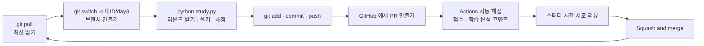
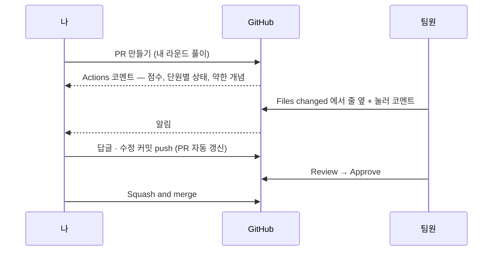

# Git 흐름 가이드

이 스터디는 문제 풀이를 **브랜치 → 커밋 → 푸시 → PR → 리뷰 → 머지** 흐름으로 제출합니다.
회사에서 쓰는 방식과 같으니, 문제를 풀면서 git 도 같이 익힙니다.



## Fork 를 떠야 하나요? (GitLab 과 비교)

아니요. 스터디장이 **Collaborator 로 초대**하면 이 저장소를 바로 `clone` 해서 브랜치를 올리고 PR 을 만들 수 있습니다.
GitLab 에서 프로젝트 멤버(Developer)가 브랜치를 푸시하고 Merge Request 를 여는 것과 같습니다.

| | Collaborator + 직접 clone (이 스터디) | Fork 방식 |
|---|---|---|
| 언제 쓰나 | 팀원끼리 한 저장소에서 작업할 때 | 쓰기 권한이 없는 남의 저장소에 기여할 때(오픈소스) |
| 흐름 | clone → 브랜치 → push → PR | fork → clone → 브랜치 → 내 fork 에 push → 원본으로 PR |
| 자동 채점 코멘트 | 달림 | 안 달림(권한 제한) — Checks 요약에서만 확인 |
| 복잡도 | 낮음 | upstream/origin 두 원격을 관리해야 함 |

PR 은 fork 없이도 **같은 저장소의 다른 브랜치 → main** 으로 만들 수 있습니다. 그래서 초대만 받으면 fork 는 필요 없습니다.

## 0. 처음 한 번

1. 스터디장이 보낸 초대(collaborator)를 수락합니다. (GitHub 알림 또는 메일)
2. 저장소를 내 컴퓨터로 가져옵니다.

```bash
git clone https://github.com/<스터디장ID>/rokey-python-study.git
cd rokey-python-study
python study.py                        # 처음 실행하면 깃허브 ID 를 묻고 진단 테스트를 만들어 줍니다
```

> `python` 이 안 되면 `python3` 로 실행하세요.

## 1. 매일 하는 흐름

```bash
# ① 최신 상태 받기 (새 문제 세트가 main 에 들어와 있습니다)
git switch main
git pull

# ② 내 브랜치 만들기  (이름 규칙: <내ID>/<아무 이름>. 하루 하나면 충분합니다)
git switch -c minsu/day3

# ③ 풀기 — 명령은 하나
python study.py          # 라운드 받기 → 풀기 → 다시 실행하면 채점·판정·다음 라운드

# ④ 내 폴더를 커밋하고 올리기 (profile.json 과 라운드 폴더가 함께 올라갑니다)
git add submissions/minsu
git commit -m "3일차 라운드"
git push -u origin minsu/day3
```

⑤ GitHub 저장소 페이지에 뜨는 **Compare & pull request** 버튼으로 PR 을 만듭니다.

⑥ 잠시 뒤 Actions 가 PR 에 **점수와 학습 분석**(단원별 상태, 약한 개념)을 코멘트로 답니다.

⑦ 스터디 시간에 서로의 분석을 보며 약한 단원을 설명해 줍니다(리뷰 코멘트).

⑧ 리뷰가 끝나면 **Squash and merge** → 브랜치 삭제. 다음 날 ①부터 반복합니다.

### 더 풀고 나서 다시 올리기

같은 브랜치에서 `python study.py` 로 계속 풀고 커밋·푸시하면 PR 이 갱신되고 다시 분석됩니다.

```bash
git add submissions/minsu
git commit -m "라운드 4까지"
git push
```

## 2. 규칙 (CI 가 검사합니다)

- 내 폴더 `submissions/<내 ID>/` 안의 파일만 고칩니다.
- `problems/`, `study.py` 등 다른 파일은 건드리지 않습니다. (문제에 오류가 있으면 이슈로 알려 주세요)
- PR 하나에는 한 사람의 풀이만 담습니다.
- 아직 풀지 않은 차시의 다른 사람 풀이는 열어 보지 않습니다.

## 3. 자주 쓰는 명령

| 하고 싶은 것 | 명령 |
|---|---|
| 지금 상태 보기 (가장 자주 씀) | `git status` |
| 무엇을 고쳤는지 보기 | `git diff` |
| 커밋 기록 보기 | `git log --oneline` |
| 지금 브랜치 확인 | `git branch` |
| 파일 수정 취소(커밋 전) | `git restore <파일>` |
| `git add` 취소 | `git restore --staged <파일>` |

## 4. 자주 겪는 상황

**실수로 main 에서 풀고 커밋까지 했어요**

```bash
git switch -c minsu/day3     # 지금 상태 그대로 새 브랜치를 만들면 커밋이 따라옵니다
git push -u origin minsu/day3
git switch main
git reset --hard origin/main # main 을 원격과 같게 되돌림 (방금 커밋은 새 브랜치에 안전하게 있음)
```

**실수로 문제 파일(problems/)을 고쳤어요**

```bash
git restore problems/        # 커밋 전이라면 이것으로 원상 복구
```

**push 가 거부(rejected)됐어요**

원격에 내가 모르는 커밋이 있다는 뜻입니다. 같은 브랜치를 먼저 받아 온 뒤 다시 올립니다.

```bash
git pull --rebase
git push
```

**PR 에 "This branch has conflicts" 가 떠요**

사람마다 폴더가 달라 거의 생기지 않습니다. 생겼다면 main 을 내 브랜치에 합칩니다.

```bash
git switch minsu/day3
git pull origin main
# 충돌 표시(<<<<<<<)가 난 파일을 고친 뒤
git add .
git commit
git push
```

## 5. PR 에서 서로 피드백하는 방법



- PR 화면 **Files changed** 탭에서 코드 줄 옆의 `+` 를 누르면 그 줄에 코멘트가 달립니다. "왜 이렇게 풀었는지", "이렇게 하면 더 간단합니다" 같은 피드백을 남깁니다.
- 오른쪽 위 **Review changes** 로 리뷰를 마무리합니다(Comment / Approve).
- 코멘트를 받은 사람은 같은 브랜치에서 고쳐서 push 하면 PR 이 갱신됩니다. 대화는 PR 안에 남으니 나중에 다시 볼 수 있습니다.

## 6. 불편하거나 이상하면 이슈로

저장소 상단 **Issues → New issue** 를 누르면 양식 세 가지가 나옵니다.

| 양식 | 언제 |
|---|---|
| 사용이 불편하거나 오류가 나요 | 명령이 안 되거나 설명이 헷갈릴 때 (터미널 출력을 붙여 주세요) |
| 문제나 정답이 이상해요 | 문항 ID(예: `s03_Q4`)와 함께 무엇이 이상한지 |
| 문제를 더 만들어 주세요 | 더 연습하고 싶은 단원·개념 |

이슈는 스터디장에게 알림이 가고, 처리되면 이슈가 닫히면서 알림이 옵니다.

## 7. 초대받지 않은 사람이 참여하려면 (Fork 방식)

저장소를 **Fork** → 내 포크를 clone → 같은 방법으로 브랜치·커밋·푸시 → 원본 저장소로 PR.
이 경우 점수는 PR 코멘트 대신 PR 의 **Checks → 채점 → Summary** 에서 확인합니다.
