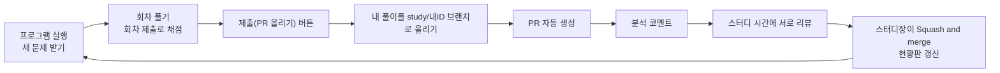
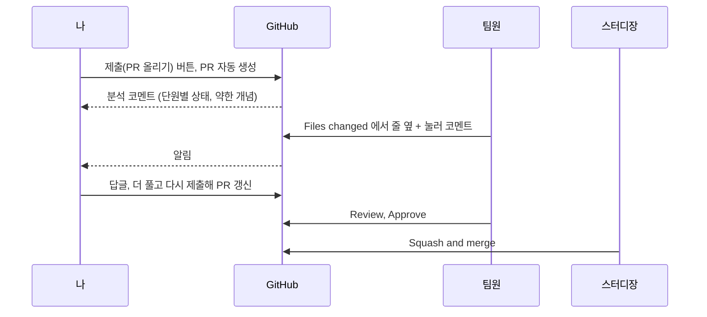

# 제출과 피드백

풀이는 프로그램의 [제출(PR 올리기)] 버튼으로 올립니다. 이 문서에는 처음 한 번 하는 로그인, 제출하면 일어나는 일, 제출이 안 될 때 확인할 것, PR 에서 서로 피드백하는 방법을 적었습니다.

## 처음 한 번 로그인

저장소에 올리려면 내 깃허브 계정으로 로그인돼 있어야 합니다. 스터디장이 보낸 저장소 초대부터 수락하세요. 수락하면 이 저장소에 올릴 수 있는 권한(Collaborator)이 생깁니다.

Windows 는 [Git for Windows](https://git-scm.com/download/win)를 설치했다면 따로 할 일이 없습니다. 처음 제출할 때 브라우저 로그인 창이 뜨고, 깃허브 계정으로 로그인하면 다음부터는 묻지 않습니다.

macOS 는 터미널에서 아래를 한 번 실행합니다. `brew` 명령이 없다고 나오면 https://brew.sh 의 설치 명령부터 실행합니다.

```bash
brew install gh
gh auth login
```

질문에는 `GitHub.com`, `HTTPS`, `Yes`(Git 인증에 사용), `Login with a web browser` 순서로 답합니다.

## 제출하면 일어나는 일



[제출(PR 올리기)]를 누르면 내 풀이 폴더가 GitHub 의 `study/<내 ID>` 브랜치로 올라갑니다. 저장소에 걸어 둔 자동 작업(GitHub Actions)이 그 브랜치로 PR 을 만들고, 단원별 상태와 약한 개념을 분석한 코멘트를 답니다.

올라가는 파일은 내 풀이 폴더 안의 것뿐입니다. 문제 파일을 실수로 건드렸어도 PR 에는 실리지 않습니다.

내 컴퓨터의 풀이는 지워지지 않습니다. 프로그램이 파일을 되돌려야 할 때는 `.git/study-backup/` 에 사본부터 남깁니다.

더 풀고 다시 누르면 열려 있는 PR 에 이어서 올라가고, PR 이 머지된 뒤에 누르면 새 PR 이 만들어집니다.

컴퓨터를 옮겨 풀 때는 쓰던 컴퓨터에서 [제출(PR 올리기)]를 누른 뒤, 다른 컴퓨터에서 같은 ID 로 프로그램을 켭니다. 올려 둔 풀이를 받아 와서 이어서 풉니다. 제출하지 않고 양쪽에서 따로 풀면 어느 쪽 풀이를 쓸지 묻는 창이 뜹니다.

## 제출이 안 될 때

프로그램이 띄운 안내를 보고 아래를 확인하세요.

| 프로그램 안내 | 확인할 것 |
|---|---|
| git 이 설치돼 있지 않아 문제 받기와 제출을 할 수 없습니다 | [Git for Windows](https://git-scm.com/download/win)를 설치하고 프로그램을 다시 켭니다 |
| 깃허브 로그인이 필요해 올리지 못했습니다 | 위의 로그인을 했는지 확인하고 [제출(PR 올리기)]를 다시 누릅니다 |
| 저장소에 접근할 권한이 없어 올리지 못했습니다 | 초대를 수락했는지, 로그인한 계정이 내 ID 가 맞는지 확인합니다. 다른 계정이 저장돼 있으면 Windows 의 '자격 증명 관리자'에서 github.com 항목을 지우고 다시 제출합니다 |
| 인터넷에 연결되지 않아 올리지 못했습니다 | 연결한 뒤 다시 누릅니다. 풀이는 컴퓨터에 남아 있습니다 |
| 저장소가 제때 응답하지 않아 멈췄습니다 | 인터넷 연결을 확인하고, 브라우저에 로그인 창이 떠 있으면 로그인한 뒤 다시 누릅니다 |
| 이 폴더는 저장소를 clone 한 폴더가 아니라 | ZIP 으로 받은 폴더입니다. README 의 주소로 `git clone` 을 다시 하고 `submissions/<내 ID>` 폴더를 새 폴더로 옮깁니다 |
| 다른 컴퓨터에서 올린 풀이가 있고, 이 컴퓨터의 풀이와 이어지지 않습니다 | 더 많이 푼 쪽을 고릅니다. [다른 컴퓨터의 풀이 가져오기]를 고르면 이 컴퓨터의 풀이는 `.git/study-backup/` 에 복사해 두고 바꿉니다 |
| 올렸습니다. PR 은 잠시 뒤 자동으로 만들어집니다 | 브라우저에 열린 화면에 [View pull request] 가 있으면 그것을, [Create pull request] 가 있으면 그 버튼을 누릅니다 |

그래도 안 되면 안내 창의 [자세히] 내용을 이슈에 붙여 주세요. 이슈 양식은 [README 의 '안 될 때'](../README.md#안-될-때)에 있습니다.

## PR 에서 피드백하기



1. 저장소의 Pull requests 탭에서 팀원의 PR 을 엽니다. 제목이 `<ID> 풀이`이고 작성자는 github-actions 로 나옵니다.
2. Files changed 탭에서 코드 줄 옆의 `+` 를 누르고 코멘트를 씁니다. 왜 이렇게 풀었는지 묻거나 더 짧게 푸는 방법을 알려 주면 됩니다. 회차 폴더의 `README.md` 가 그 회차의 문제지입니다.
3. 오른쪽 위 Review changes 에서 Comment 나 Approve(승인)를 고릅니다.
4. 리뷰가 끝나면 스터디장이 Squash and merge 를 누릅니다. PR 의 내용을 저장소(main)에 합치는 버튼이고, 검사 두 개(문제 은행 검증, 채점)가 초록색이 된 뒤에 눌립니다. 합쳐지면 브랜치는 저절로 지워지고 현황판이 바뀝니다.

PR 에는 정답과 해설이 올라가지 않습니다. 다만 사람마다 받는 문항이 달라서, 남의 PR 에는 내가 아직 안 푼 문항과 그 사람의 답, 맞았는지(`profile.json`)가 보입니다. 리뷰는 그날 내 회차를 채점([회차 제출])한 뒤에 하고, `quiz.py` 와 `profile.json` 은 열지 말고 코드 문항 파일(`s03_p02.py` 처럼 문항 이름으로 된 파일)과 분석 코멘트를 봅니다.

## 하지 않는 것

- `git pull` 이나 `git switch` 는 치지 않아도 됩니다. 쳤다가 중간에 멈춘 상태가 돼도 다음에 프로그램을 켜면 정리합니다.
- 편집기의 git 창에 [Publish Branch] 버튼이 보여도 누르지 않습니다. 올릴 때는 프로그램의 [제출(PR 올리기)]를 씁니다.
- PR 화면의 Commit suggestion 이나 연필(웹 편집)로 고친 내용은 내 컴퓨터로 내려오지 않고, 다음에 제출하면 내 컴퓨터의 내용으로 되돌아갑니다. 고칠 것은 프로그램에서 고친 뒤 다시 제출합니다.
- fork 는 하지 않습니다. fork 는 쓰기 권한이 없는 남의 저장소에 기여할 때 내 계정에 저장소를 복사해 거기에 올리는 방식입니다. fork 를 clone 한 폴더에서는 제출이 내 fork 에만 올라가 팀 PR 과 현황판에 나오지 않고 새 문제도 받지 못하므로, README 의 주소로 이 저장소를 clone 합니다.
- 문제 파일을 고쳐 보고 싶으면 스터디장에게 먼저 알려 주세요.

## 참고: 제출 버튼이 git 으로 하는 일

git 을 직접 써 본 사람을 위한 설명이고, 몰라도 제출할 수 있습니다.

| 프로그램이 하는 일 | git 명령으로 하면 |
|---|---|
| 켤 때마다 새 문제 받기 | `git fetch` 로 최신 main 을 받아 문제 파일을 맞춥니다 |
| 내 풀이 묶기 | 내 폴더 `submissions/<내 ID>/` 만 담은 커밋을 만듭니다 |
| 올리기 | `study/<내 ID>` 브랜치로 `git push` 합니다 |
| PR 만들기 | 저장소의 자동 작업(GitHub Actions)이 그 브랜치로 PR 을 엽니다 |

제출이 끝나면 내 컴퓨터의 `study/<내 ID>` 브랜치도 올린 풀이에 맞춰져서, `git status` 와 편집기의 git 창에 내 풀이가 바뀐 파일로 남지 않습니다. 제출한 뒤에 더 푼 답은 다음 제출 때까지 바뀐 파일로 보입니다.

제출 버튼이 한 일은 아래 명령으로 볼 수 있습니다. 모두 보기만 하는 명령입니다.

| 보고 싶은 것 | 명령 |
|---|---|
| 지금 브랜치와 바뀐 파일 | `git status` |
| 커밋 기록 | `git log --oneline -5` |
| 원격에 올라간 내 브랜치 | `git log --oneline origin/study/<내 ID> -3` |
| 내 풀이가 main 과 무엇이 다른지 | `git diff origin/main --stat -- submissions/<내 ID>` |

커밋 기록 맨 위에 `제출한 풀이 반영(이 컴퓨터에만 둠)` 이 보일 때가 있습니다. 프로그램을 켠 뒤 main 에 새 문제나 다른 사람의 풀이가 들어온 상태에서 제출하면 생기는 커밋이고, 올라가지 않습니다. 다음에 프로그램을 켜면 최신 main 에 맞춰 정리됩니다.
