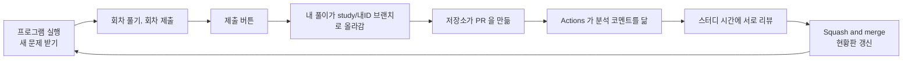
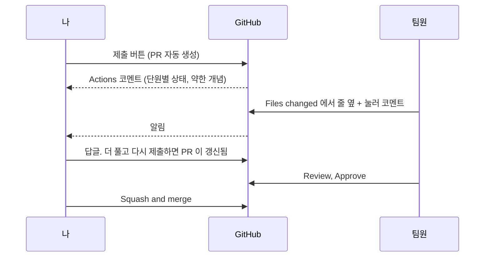

# 제출과 피드백

풀이는 프로그램의 [제출(PR 올리기)] 버튼으로 올립니다. 이 문서에는 그 버튼이 git 으로 무엇을 하는지, 처음 한 번 하는 로그인, PR 에서 서로 피드백하는 방법을 적었습니다.



## 제출 버튼이 하는 일

| 프로그램이 하는 일 | git 명령으로 하면 |
|---|---|
| 켤 때마다 새 문제 받기 | `git fetch` 로 최신 main 을 받아 문제 파일을 맞춤 |
| 내 풀이 묶기 | 내 폴더 `submissions/<내 ID>/` 만 담은 커밋 만들기 |
| 올리기 | `study/<내 ID>` 브랜치로 `git push` |
| PR 만들기 | 저장소의 Actions 가 그 브랜치로 PR 을 엶 |

올라가는 파일은 내 풀이 폴더 안의 것뿐입니다. 문제 파일을 실수로 건드렸어도 PR 에는 실리지 않습니다.

내 컴퓨터의 풀이는 지우지 않습니다. 프로그램이 파일을 되돌려야 할 때는 `.git/study-backup/` 에 사본부터 남깁니다.

더 풀고 다시 누르면 열려 있는 PR 에 이어서 올라가고, PR 이 머지된 뒤에 누르면 새 PR 이 만들어집니다.

제출이 끝나면 내 컴퓨터의 `study/<내 ID>` 브랜치도 올린 풀이에 맞춰져서, `git status` 와 편집기의 git 창에 내 풀이가 바뀐 파일로 남지 않습니다. 제출한 뒤에 더 푼 답은 다음 제출 때까지 바뀐 파일로 보입니다.

`git pull` 이나 `git switch` 를 따로 칠 일은 없습니다. 쳤다가 중간에 멈춘 상태가 돼도 다음에 프로그램을 켜면 정리합니다.

## 처음 한 번 로그인

저장소에 올리려면 내 깃허브 계정으로 로그인돼 있어야 합니다. 스터디장이 보낸 초대(Collaborator)부터 수락하세요.

Windows 는 [Git for Windows](https://git-scm.com/download/win)를 설치했다면 따로 할 일이 없습니다. 처음 제출할 때 브라우저 로그인 창이 뜨고, 깃허브 계정으로 로그인하면 다음부터는 묻지 않습니다.

macOS 는 터미널에서 아래를 한 번 실행합니다.

```bash
brew install gh
gh auth login
```

질문에는 `GitHub.com`, `HTTPS`, `Yes`(Git 인증에 사용), `Login with a web browser` 순서로 답합니다.

제출이 안 될 때는 프로그램이 띄운 안내를 보고 아래를 확인하세요.

| 프로그램 안내 | 확인할 것 |
|---|---|
| 깃허브 로그인이 필요해 올리지 못했습니다 | 위의 로그인을 했는지. 한 뒤 제출을 다시 누릅니다 |
| 저장소에 접근할 권한이 없어 올리지 못했습니다 | 초대를 수락했는지, 로그인한 계정이 내 ID 가 맞는지. 다른 계정이 저장돼 있으면 Windows 의 '자격 증명 관리자'에서 github.com 항목을 지우고 다시 제출합니다 |
| 인터넷에 연결되지 않아 올리지 못했습니다 | 연결한 뒤 다시 누릅니다. 풀이는 컴퓨터에 남아 있습니다 |
| 이 폴더는 저장소를 clone 한 폴더가 아니라 | ZIP 으로 받은 폴더입니다. `git clone` 으로 다시 받고 `submissions/<내 ID>` 폴더를 옮기세요 |

그래도 안 되면 안내 창의 [자세히] 내용을 이슈에 붙여 주세요.

## PR 에서 피드백하기



1. 저장소의 Pull requests 탭에서 팀원의 PR 을 엽니다.
2. Files changed 탭에서 코드 줄 옆의 `+` 를 누르고 코멘트를 씁니다. 왜 이렇게 풀었는지 묻거나 더 짧게 푸는 방법을 알려 주면 됩니다. 회차 폴더의 `README.md` 가 그 회차의 문제지입니다.
3. 오른쪽 위 Review changes 에서 Comment 나 Approve 를 고릅니다.
4. 리뷰가 끝나면 Squash and merge 를 누릅니다. 브랜치는 저절로 지워지고 현황판이 바뀝니다.

PR 화면의 Commit suggestion 이나 연필(웹 편집)로 고친 내용은 내 컴퓨터로 내려오지 않고, 다음에 제출하면 내 컴퓨터의 내용으로 되돌아갑니다. 고칠 것은 프로그램에서 고친 뒤 다시 제출하세요.

PR 에는 정답과 해설이 올라가지 않습니다. 다만 사람마다 받는 문항이 달라서, 남의 PR 에는 내가 아직 안 푼 문항과 그 사람의 답, 맞았는지(`profile.json`)가 보입니다. 리뷰는 그날 내 회차를 제출한 뒤에 하고, `quiz.py` 와 `profile.json` 은 열지 말고 코드 문항(`.py` 파일)과 Actions 코멘트 위주로 보세요.

## 불편하거나 이상하면

저장소의 Issues → New issue 를 누르면 양식이 나옵니다.

| 양식 | 언제 |
|---|---|
| 사용이 불편하거나 오류가 납니다 | 프로그램이 안 되거나 설명이 헷갈릴 때. 오류 창의 [오류 내용 복사]를 붙여 주세요 |
| 문제나 정답이 이상합니다 | 문항 ID(예: `s03_Q4`)와 무엇이 이상한지 |
| 문제를 더 만들어 주세요 | 더 연습하고 싶은 단원이나 개념 |

이슈를 쓰면 스터디장에게 알림이 가고, 처리되면 이슈가 닫히면서 알림이 옵니다.

## fork 를 떠야 하나요

안 떠도 됩니다. 스터디장이 Collaborator 로 초대하면 이 저장소를 바로 clone 해서 브랜치를 올리고 PR 을 만들 수 있습니다. GitLab 에서 프로젝트 멤버(Developer)가 브랜치를 푸시하고 Merge Request 를 여는 것과 같은 방식입니다.

| | Collaborator 로 직접 clone (이 스터디) | fork |
|---|---|---|
| 언제 쓰나 | 팀원끼리 한 저장소에서 작업할 때 | 쓰기 권한이 없는 남의 저장소에 기여할 때 |
| 흐름 | clone, 브랜치, push, PR | fork, clone, 브랜치, 내 fork 에 push, 원본으로 PR |
| 제출 버튼 | 됩니다 | fork 를 clone 한 폴더에서는 내 fork 에만 올라가 팀 PR 과 현황판에 나오지 않고, 새 문제도 받지 못합니다. 원본 저장소를 clone 하세요 |

## git 으로 직접 확인해 보기

제출 버튼이 한 일을 명령으로 볼 수 있습니다. 아래는 보기만 하는 명령입니다.

| 보고 싶은 것 | 명령 |
|---|---|
| 지금 브랜치와 바뀐 파일 | `git status` |
| 커밋 기록 | `git log --oneline -5` |
| 원격에 올라간 내 브랜치 | `git log --oneline origin/study/<내 ID> -3` |
| 내 풀이가 main 과 무엇이 다른지 | `git diff origin/main --stat -- submissions/<내 ID>` |

편집기의 git 창에 [Publish Branch] 단추가 보여도 누르지 말고, 올릴 때는 프로그램의 [제출] 버튼을 쓰세요.

커밋 기록 맨 위에 `제출한 풀이 반영(이 컴퓨터에만 둠)` 이 보일 때가 있습니다. 프로그램을 켠 뒤 main 에 새 문제나 다른 사람의 풀이가 들어온 상태에서 제출하면 생기는 커밋이고, 올라가지 않습니다. 다음에 프로그램을 켜면 최신 main 에 맞춰 정리됩니다.

문제 파일을 고쳐 보고 싶으면 스터디장에게 먼저 알려 주세요.
